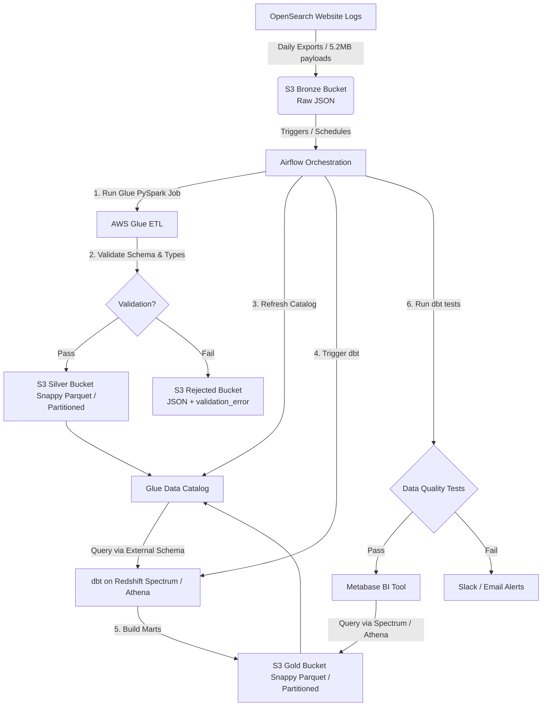

# Studocu Data Lake & Analytics POC (OpenSearch Events Ingestion)

This repository contains the architecture design and a complete Proof of Concept (POC) implementation addressing the **Studocu Medior Data Engineer Case Study**. 

---

## 1. Executive Summary & Architecture Design

The goal is to ingest, validate, partition, and transform a large volume of unstructured OpenSearch event logs (**12.4 TB historical + daily increments**) and make them available to analysts and the SEO team.

### Architecture Overview

To achieve maximum scalability, cost-efficiency, and seamless integration with Studocu's current AWS-based stack, we implement a **Medallion Architecture (Bronze $\rightarrow$ Silver $\rightarrow$ Gold)** utilizing serverless AWS services and dbt on Redshift Spectrum.



### Component Design Details

| Component | Technology | Rationale & Design Decision |
| :--- | :--- | :--- |
| **Storage (Bronze / Silver / Rejected)** | **Amazon S3** | Severless storage with 99.999999999% durability. Highly cost-effective. Organized into Bronze (raw JSON), Silver (clean Parquet), and Rejected (validation failures). |
| **ETL & Validation** | **AWS Glue (PySpark)** | Serverless Spark. Scales horizontally to handle 12.4 TB of historical logs. Performs row-level validation, formats fields, and writes compressed Parquet. |
| **Data Catalog** | **Glue Catalog & Crawler** | Automatically maintains table schemas and partition metadata, making the S3 data lake queryable. |
| **DWH Ingestion / Query** | **Redshift Spectrum / Athena** | Enables querying the S3 Silver and Gold layers directly using external tables. Avoids loading the 12.4 TB dataset (or its aggregates) into Redshift local storage, saving significant costs while maintaining query access. |
| **Data Transformation & Modeling** | **dbt (data build tool)** | Defines SQL transformations (Staging & Gold Marts). It writes both staging and final aggregated results as external tables back to S3, using Athena or Redshift Spectrum. |
| **Orchestration** | **Apache Airflow** | Schedules daily runs, runs crawlers, invokes dbt, and manages dependencies and alerts. |

---

## 2. Processing Strategy: Historical vs. Daily Data

Handling the **12.4 TB** scale difference between the historical backfill and the daily increments requires specific tuning.

### A. Historical Data Backfill
* **Glue Job Scaling**: We scale the Glue job by setting the worker type to `G.2X` (16 vCPU, 64 GB RAM) and allocation up to `50 DPUs` (Data Processing Units) to maximize parallelism.
* **Optimize Spark Partitions**: We adjust `spark.sql.files.maxPartitionBytes` to prevent Out-Of-Memory (OOM) errors when parsing millions of small log files, and coalesce output files to avoid the "small file problem."
* **Athena/Spectrum Bulk Queries**: Using S3 partitioning by `year/month/day` enables us to run backfills incrementally in batches (e.g., month-by-month or year-by-year) to stay within concurrency limits.

### B. Daily Data Ingestion
* **Incremental Runs**: The daily Airflow pipeline only processes the latest partition (`/bronze/year=YYYY/month=MM/day=DD/`).
* **Scale-to-Zero**: Since the daily payload size is modest, Glue DPUs automatically scale down to the minimum (e.g., `2 DPUs`) to save costs.

---

## 3. Integration with the Current Stack & Extensions

Our proposed solution fits cleanly into Studocu’s existing stack without requiring new proprietary tools:

1. **Leveraging Existing Redshift Cluster (Redshift Spectrum)**:
   * We register the Glue Catalog schema as an external schema in Redshift.
   * Redshift Spectrum delegates S3 query execution to a dedicated virtualization layer.
   * Analysts can run SQL joins combining S3 event logs (both Silver event-level and Gold aggregates) with core local DWH tables (e.g., users, documents) in Redshift.
2. **dbt Integration**:
   * dbt runs on top of Redshift/Athena. It creates models as external tables, meaning both the Silver (staging) and Gold (marts) data reside entirely on S3. No local Redshift storage is consumed, yet all tables are fully queryable from Redshift or Athena.
3. **Metabase BI**:
   * Metabase queries the aggregated Marts in S3 via either Athena (for serverless pay-per-query pricing) or Redshift Spectrum (to easily join with core dimensional tables).
4. **Future Extensions**:
   * **AWS Lake Formation**: Add fine-grained column-level/row-level permissions for sensitive user logs.
   * **Apache Iceberg Format**: If events need to be deleted (e.g., GDPR requests) or mutated, transition the Silver layer to Apache Iceberg format.

---

## 4. POC Implementation Walkthrough

The codebase contains a functional, production-ready POC structured as follows:

```
├── README.md                      <-- Case study overview and architecture design
├── generate_events.py             <-- Test dataset generator & S3 uploader
├── glue_bronze_to_silver.py       <-- Glue PySpark ETL Script
├── airflow/
│   └── dags/
│       └── studocu_daily_pipeline.py <-- Production Airflow DAG definition
└── studocu_dbt/                   <-- dbt transformation project
    ├── dbt_project.yml
    └── models/
        ├── staging/
        │   ├── sources.yml
        │   └── stg_events.sql     <-- External table staging model
        └── marts/
            ├── schema.yml
            └── daily_event_summary.sql <-- Gold aggregated metrics model
```

### Key Components

#### 1. Ingestion & Validation Script
The PySpark script ([glue_bronze_to_silver.py](file:///Users/nishanth_p/Desktop/Studocu/glue_bronze_to_silver.py)) implements robust validation:
* Defines an explicit schema (`expected_schema`) to prevent schema drift.
* Flags and isolates anomalies (missing keys, invalid event types, malformed dates) into a `validation_error` field.
* Writes valid rows as compressed, partitioned Parquet to `s3://.../silver/`.
* Quarantines invalid records to `s3://.../rejected/` for analysis.

#### 2. Airflow Orchestrator
The Airflow DAG ([studocu_daily_pipeline.py](file:///Users/nishanth_p/Desktop/Studocu/airflow/dags/studocu_daily_pipeline.py)) defines the workflow:
* Initiates the Glue ETL job with execution arguments.
* Moniters job execution via `GlueJobSensor`.
* Refreshes the Glue Crawler (`refresh_silver_catalog`) so that the newly added partition immediately shows up in Athena and Redshift Spectrum.
* Executes dbt models (`dbt run` and `dbt test`) and alerts the team on Slack if a failure occurs.

#### 3. dbt Models
* **Staging Model** ([stg_events.sql](file:///Users/nishanth_p/Desktop/Studocu/studocu_dbt/models/staging/stg_events.sql)): Interfaces with the Glue Catalog data and casts formats.
* **Gold Mart Model** ([daily_event_summary.sql](file:///Users/nishanth_p/Desktop/Studocu/studocu_dbt/models/marts/daily_event_summary.sql)): Aggregates event counts, unique users, unique sessions, document counts, premium user interactions, and average session durations by `country_code`, `device_type`, and `event_type`.

---

## 5. Production Resilience: Anomalies & Schema Evolution

### Handling Schema Evolution
* **Schema Drift Detection**: The Glue job uses explicit schema parsing (`StructType`). 
* If a new field is introduced at the source, it will be ignored by default until the Spark schema configuration is updated. This avoids breaking downstream pipelines.
* Alternatively, if schema evolution is expected frequently, we can load logs as a map type, query dynamic fields using Spark JSON parse functions, or utilize **dbt schema tests** to catch alterations.

### Handling Bad Data (The Rejected Quarantine)
* We write anomalous records to `/rejected/` partitioned by ingestion date.
* We include a `validation_error` column detailing exactly which assertion failed (e.g., `missing_event_id`, `duration_not_integer`).
* Analysts can query the `/rejected/` location via Athena to monitor anomaly rates and identify upstream bugs.

---

## 6. How to Run the POC Locally / Setup

### 1. Requirements & Dependencies
* Python 3.11+
* dependencies listed in [requirements.txt](file:///Users/nishanth_p/Desktop/Studocu/requirements.txt) (`boto3`, `dbt-redshift`, etc.)

### 2. Generate and Upload Fake Events
To generate a mock dataset representing 3 days of traffic (including 5% anomalies/bad records) and upload it to your S3 bucket:
```bash
python generate_events.py
```

### 3. Deploy Glue Script
Upload [glue_bronze_to_silver.py](file:///Users/nishanth_p/Desktop/Studocu/glue_bronze_to_silver.py) to your AWS Glue script bucket location and configure a Glue Job referencing the script.

### 4. Running dbt
To compile and test the dbt models:
```bash
cd studocu_dbt
dbt run --profiles-dir ~/.dbt
dbt test --profiles-dir ~/.dbt
```
